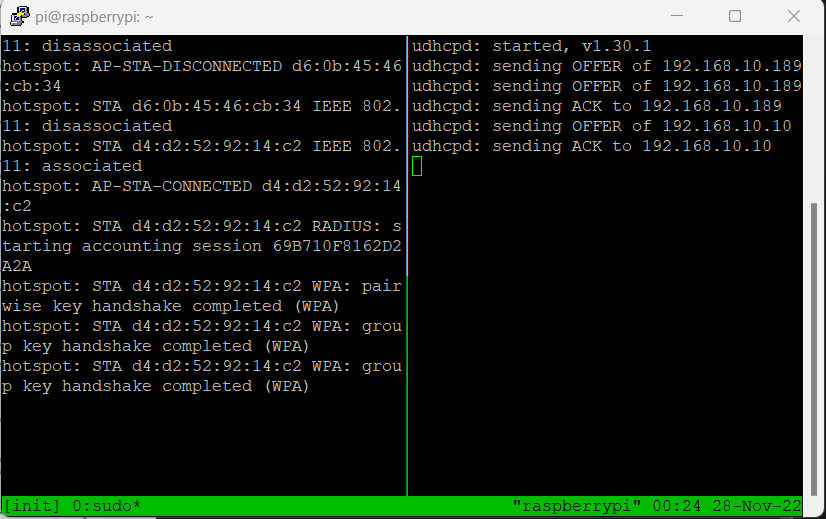
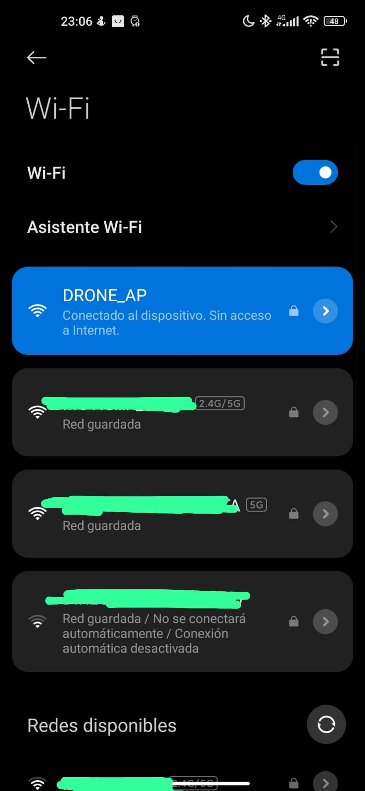

# ar-drone-hijack

### Javier Pinzón Díaz

---

Esta herramienta está diseñada para tomar control de un dron “Parrot ARDrone 2.0” sin autorización de usuario legítimo. El software le quita el control al piloto y toma el control, permitiendo manejar el dron sin que el usuario pueda volver a tomar control de este. Todo el proceso se realiza de forma automática ejecutando únicamente un script.

## Instalación

---

```powershell
git clone https://github.com/javierpinzon00/ar-drone-hijack
cd ar-drone-hijack
sudo ./setup.sh
```

## Uso

---

Antes de ejecutar el script tienes que conocer el nombre que tiene la interfaz que vas a utilizar tanto cuando esta en modo monitor como cuando no lo está.

```bash
sudo python3 drone_crack.py <interfaz> [-i <interfaz_mon>]

# if interface == interface_mon
sudo python3 drone_crack.py <interfaz>

# if interface != interface_mon
sudo python3 drone_crack.py <interfaz> -i <interfaz_mon>
```

## Funcionalidades del proyecto

---

Se ha configurado una Raspberry Pi para que cuando se encienda levante un punto de acceso Wifi, convirtiendo la herramienta en portátil, permitiendo controlarla de forma remota y así se pueda acercar más a su objetivo principal, estar montado todo en un dron y así poder afectar a otros drones que se encuentren cerca.

Para ello se ha desarrollado este script el cual tiene que estar como cron para cuando se encienda el dispositivo.

```bash
# Se crea una interfaz virtual para el punto de acceso utilizando
# la tarjeta de red integrada en la raspberry.
iw phy phy0 interface add hotspot type __ap
ifconfig hotspot 192.168.10.1 up

# Se utiliza tmux para que se quede corriendo en segundo plano y se pueda acceder
# desde otra sesión.
tmux new-session -d -s init 'sudo hostapd /home/pi/hostapd.conf'
tmux split-pane -h -t init 'sudo udhcpd -f'

# Para esto se hace uso de los ficheros "udhcpd.conf" ubicado en /etc/
# y el fichero "hostapd.conf" que está en el directorio del proyecto.
```



Sesión de tmux para el AP

Y la herramienta desarrollada, la cual permite quitarle el control del dron al usuario legítimo de una forma automática. La herramienta ha sido desarrolla en su totalidad con `python3` y llamadas al sistema.

El funcionamiento de la herramienta es el siguiente:


Flujo de la aplicación

- Análisis de la red en busca de un punto de acceso que pertenezca a un dron (filtrando por su MAC).

- Una vez se encuentra el dispositivo se analiza para identificar al usuario que está conectado.

- Cuando se localiza al usuario legítimo se guarda su MAC para suplantarle y se inicia un proceso de desautenticación.

- Una vez se le desautentica se cambia la MAC de la tarjeta de red por la del cliente legítimo.
    
    Este paso es necesario si el dron está volando, ya que una vez se inicia el vuelo, la nave solo puede ser manejada desde el dispositivo que lo inició.
    
- Una vez se impersona la MAC y se desautentica al usuario, se conecta al punto de acceso generado por el drone.

- Una vez se ha conectado ya se puede tomar control de la nave. El software está hecho para que la nave realice unas instrucciones previamente asignadas.
    
    Para esta funcionalidad se ha utilizado la librería `python-ar-drone`. Esta librería está escrita en python2.7, la cual permite controlar todas las funcionalidades del dron desde funciones desarrolladas en python.
    

Próximos desarrollos:

- Redirección de trafico del dron a la Raspberry para controlarlo desde el móvil, para un mejor manejo de la nave. (Este desarrollo no se ha realizado ya que se necesitaba tener un dispositivo móvil “rooteado” para poder suplantar la MAC de la víctima).

## EVIDENCIAS

---

Nos conectamos a la Raspberry Pi por el AP que esta genera y por ssh a la ip `192.168.10.1`.



Punto de acceso wifi

Ejecutamos el script de `drone_crack.py`.


El dispositivo del cliente pierde la conexión con el dron.


Se toma control del dron haciendo que gire y acabe aterrizando.

## PROBLEMAS

---

En la parte de controlar el dron con otro dispositivo móvil he encontrado problemas ya que se necesitaría un dispositivo rooteado para poder cambiar su MAC y no tenía ningún dispositivo para poder rootearlo.

Al utilizar una batería portátil como fuente de alimentación a la Raspberry, esta no tenía suficiente potencia para la utilización de la tarjeta de red externa.

Se ha tenido que utilizar una cuerda para evitar accidentes.

## Material utilizado

---


- Raspberry Pi 4B
- Tarjeta de red (se ha utilizado la “Alfa AWUS036AC”)
- Dron Parrot ARDrone2.0 para simular a la víctima.
- Cuerda (sujetar dron para evitar accidentes)

## Software utilizado

---

- La suite de `aircrack-ng`.
    
    Utilizada para analizar la red en busca del punto de acceso del dron y el usuario para su posterior des autenticación y suplantación.
    
- La librería https://github.com/venthur/python-ardrone para el manejo del dron desde la terminal.